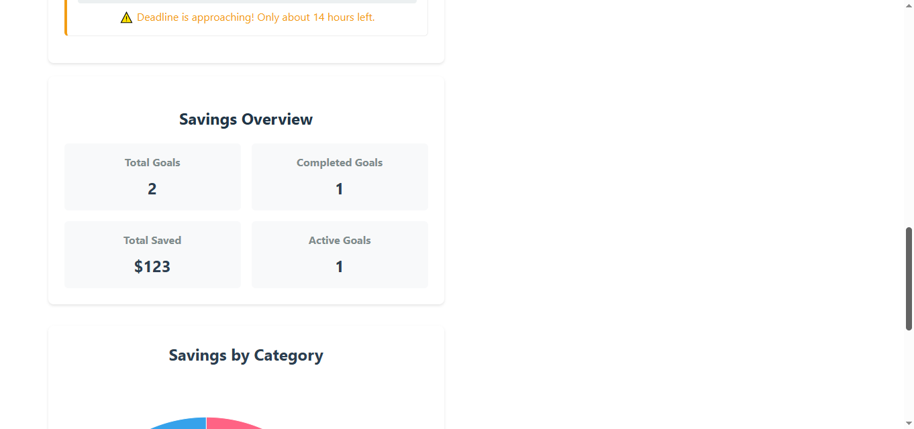
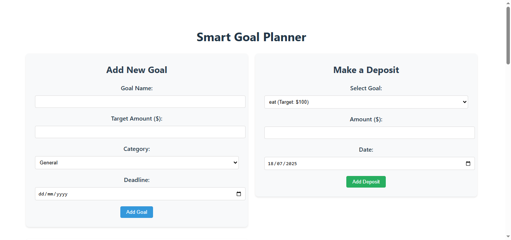
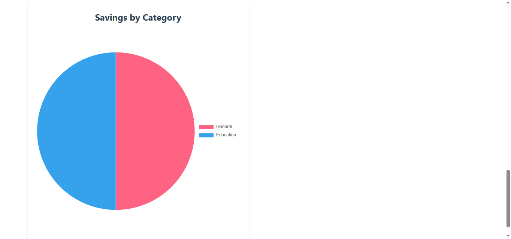
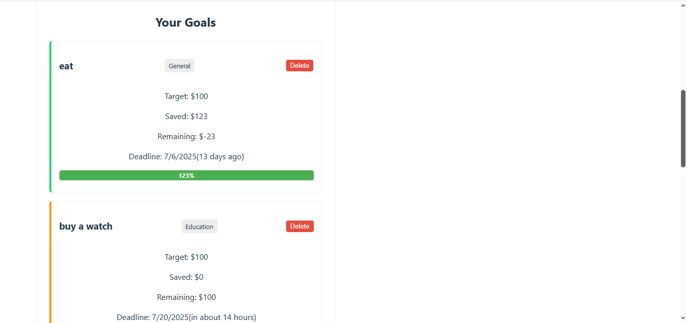

# Smart Goal Planner

 



A financial goal management dashboard that helps users track multiple savings goals, allocate deposits, and monitor progress.

## Features

- 🎯 Create, edit, and delete financial goals
- 💰 Make deposits towards specific goals
- 📊 Visual progress tracking with progress bars
- 📅 Deadline tracking with overdue warnings
- 📈 Savings analytics with category breakdown
- 📱 Responsive design for all devices

## Technologies Used

- React (Vite)
- React Router
- Chart.js (for data visualization)
- date-fns (for date handling)

## Live Demo
- **Frontend**: [https://goal-planner-blue.vercel.app/](https://goal-planner-blue.vercel.app/)
- **Backend API**: [https://goal-planner-kz4h.onrender.com](https://goal-planner-kz4h.onrender.com)


## Installation & Setup

### 1. Fork and Clone the Repository

```bash
# Fork the repository on GitHub first
# Then clone your forked version:
git clone git@github.com:James-Patrick416/goal-planner.git
cd smart-goal-planner

2. Install Dependencies
bash
npm install

Set Up JSON Server
Create a db.json file in the root directory with this structure:

json
{
  "goals": [],
  "deposits": []
}

 Run the Application
You'll need two terminal sessions:

Terminal 1 (Backend - JSON Server):

bash
npm run server
Terminal 2 (Frontend - Vite):

bash
npm run dev

Project Structure
smart-goal-planner/
├── src/
│   ├── components/
│   │   ├── DepositForm/
│   │   ├── GoalForm/
│   │   ├── GoalList/
│   │   ├── ProgressBar/
│   │   ├── SavingsChart/
│   │   └── SavingsOverview/
│   ├── pages/
│   │   └── Dashboard.jsx
│   ├── App.jsx
│   ├── main.jsx
│   └── App.css
├── public/
│   ├── sceenshot2.png
│   ├── screenshot.png
│   ├── screenshot1.png
│   └── screenshot3.png
├── db.json
├── package.json
└── README.md
How to Use
Add Goals: Fill out the goal form with name, target amount, category, and deadline

Make Deposits: Allocate funds to specific goals using the deposit form

Track Progress: View progress bars and remaining amounts for each goal

Monitor Overview: Check your total savings and category breakdown

Core Functionality Implemented
State management with React hooks

CRUD operations for goals and deposits

Form validation and error handling

Responsive UI design

Data persistence with JSON Server

Data visualization with Chart.js